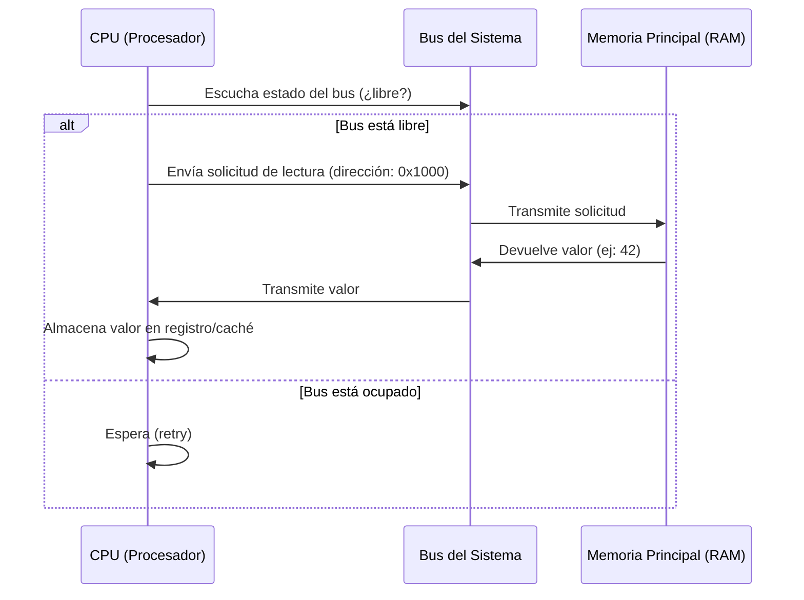
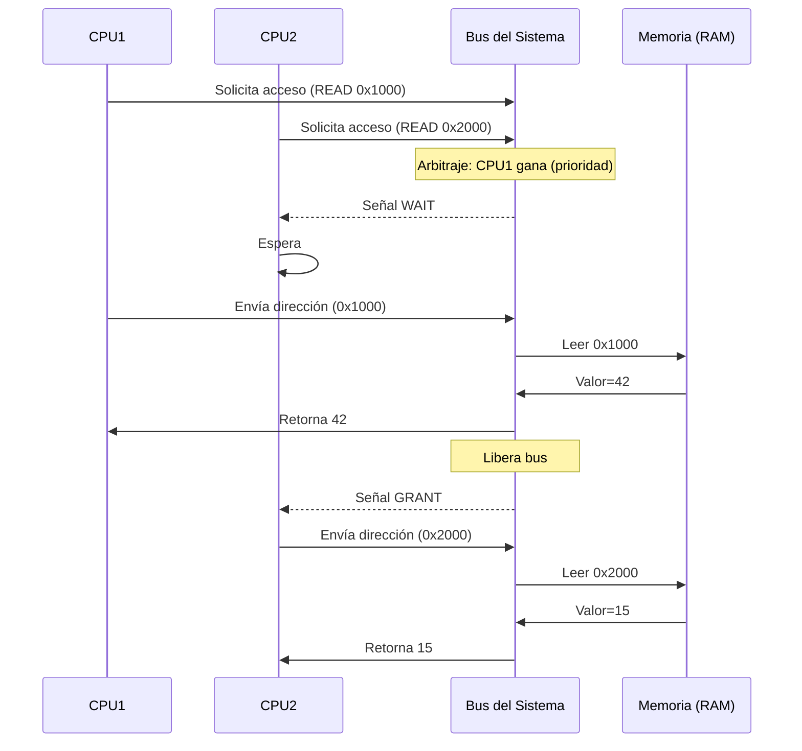

# Reading Data From Memory
## Keywords
- #bus 
- kewword2

## Notes
El proceso de lectura de la CUP a la memoria RAM es el siguiente:
1. Solicitud de variable en memoria compatida
2. Verificación del estado del bus
3. Solicitud de lectura
4. Respuesta de la memoria
5. Liberación del bus

### 1. Necesidad del CPU de leer una variable en memoria
Cuando el CPU requiere leer una variable en memoria lo hace mediante un [[BUS]] (canal de comunicación para transferir datos entre componentes del sistema.

### 2. Verificación del estatus del bus (arbitraje)
Antes de usar el bus el CPU debe asegurarse que nadie mas lo esta utilizando esto lo hace con un protocolo de arbitraje:
1. El CPU escucha monitorea las señales del bus para saber si esta ocupado (con otra transacción en curso).
2. Si el bus esta libre procede a enviar la solicitud.
3. Si esta ocupado el CPU espera (en el libro de concurrencia en go explica las colar y el switching).

### 3. Solicitud de lectura
Una vez que el bus esta libre el CPU envía:
- **Dirección de memoria**: La ubicación física donde está almacenada la variable (ej. `0x7FFF4`).
- **Tipo de operación**: Una señal que indica que es una lectura (no escritura).
Lo anterior se realiza por una señal eléctrica a travez del bus.

### 4. Respuesta de la memoria al CPU
Una vez que la memoria recibe la orden realiza lo siguiente:
1. Decodifica la dirección en memoria para tratar de acceder a la variable.
2. Lee el dato almacenado en la ubicación.
3. Coloca el valor en el bus de datos para que el CPU lo capture.
El CPU que esta escuchando el bus toma el dato y lo almacena en su entorno local o dependiendo de la arquitectura puede guardarlo en su memoria cache.

### 5. Liberación del bus
Una vez completado el proceso el bus se libera para que pueda ser usado por otros procesadores o dispositivos.

### Secuencia de lectura de una variable compartida.

### Secuencia de lectura de una variable compartida con mas de un CPU.

## Questions?
- [ ] La variables pueden estar locales por ejemplo en una goroutine?
- [ ] En que casos podríamos tener estas variables?
- [ ] que pasa entonces con el tema de write-throught todos los sistemas funcionan asi?, se activa o desactiva la funcionalidad? 

## Resources
4. **"Programación Concurrente y Distribuida en Java"**
    - **Autor**: Alfonso Urso (Disponible en español).
    - **Contenido**: Exclusión mutua, sincronización y modelos de memoria.
    - **Editorial**: Ra-Ma.
5. **"Sistemas Operativos Modernos"**
    - **Autor**: Andrew S. Tanenbaum (Traducido al español).
    - **Contenido**: Gestión de recursos compartidos y comunicación entre procesos.
    - **Editorial**: Pearson.
6. **"Programación en Go: Concurrencia y Paralelismo"**
    - **Autor**: Francisco Javier Cepeda (En español).
    - **Contenido**: Modelos de concurrencia aplicados a bajo nivel (ej. acceso a memoria).
    - **Editorial**: 0xWord.
## Summary

> [!important]
> Cuando un CPU quiere acceder a un recurso compartido en memoria primero verifica si el bus esta libre, si no esta libre, espera y sigue escuchando el bus, cuando se libera manda una señal para consultar la memoria, envía la dirección de memoria y una señal de lectura, la ram accede al espacio en memoria y coloca el dato en el bus, dependiendo de la arquitectura el CPU guarda el dato en memoria local o en cache.