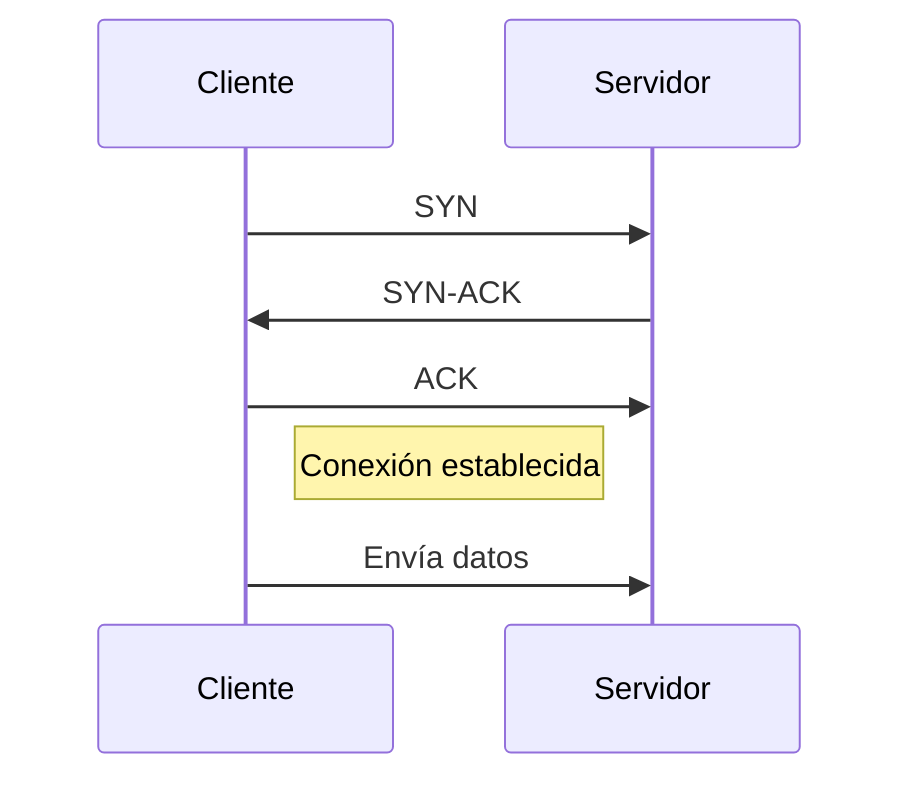
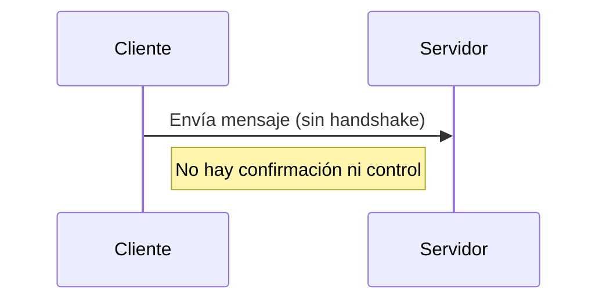
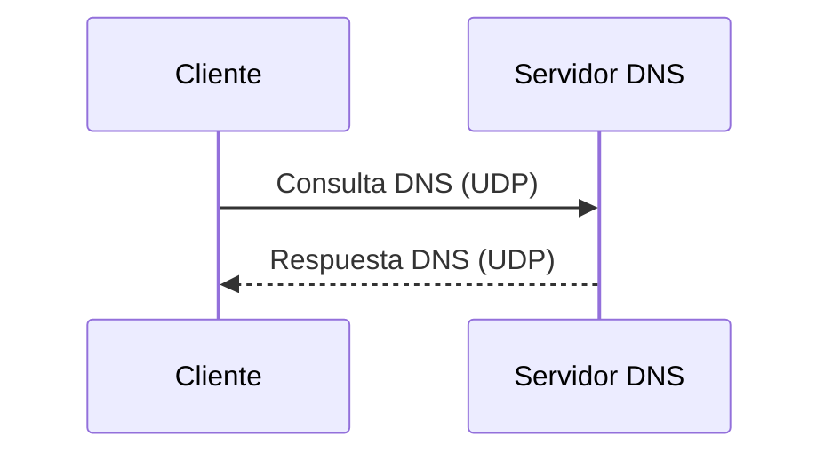
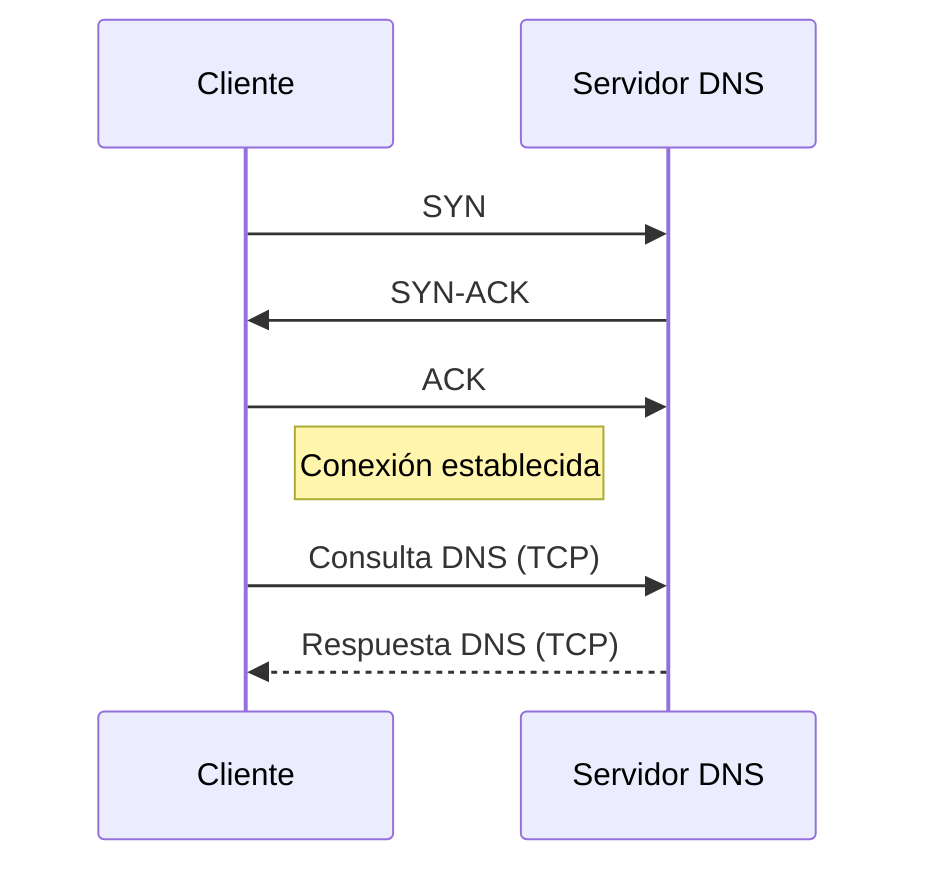

# Diferencia entre TCP y UDP (en contexto de DNS)

## ¿Qué significa que UDP no requiere conexión previa?

Cuando se dice que **UDP no necesita conexión previa**, significa que **envía los datos directamente sin negociar ni verificar antes si el receptor está listo**.

---

## Comparación entre TCP y UDP

### TCP (requiere conexión previa)

### UDP (sin conexión)

---

## Ejemplo cotidiano

- **TCP**: Como hacer una llamada telefónica (esperar a que contesten)
    
- **UDP**: Como gritar algo por la ventana (esperar que alguien escuche)
    

---

## En el caso de DNS

DNS **usa UDP por defecto** porque:

- Es más rápido
    
- Las respuestas suelen ser pequeñas
    

### Consulta DNS por UDP:

---

## Casos en que DNS usa TCP

1. Respuestas muy grandes (más de 512 bytes)
    
2. Transferencia de zonas DNS (entre servidores)
    

### Consulta DNS por TCP:

